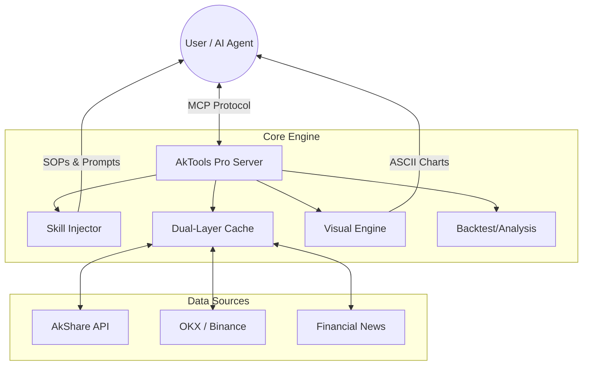

<div align="center">

# 📈 AkTools Pro MCP Server

<p align="center">
  <b>让 AI 成为你的金融分析师</b><br>
  <i>Empower your AI Agents with Professional Financial Intelligence</i>
</p>

<p align="center">
    <a href="https://github.com/tchivs/mcp-aktools/releases"></a>
    <a href="https://github.com/tchivs/mcp-aktools/blob/main/LICENSE"></a>
    <a href="https://www.python.org/"></a>
    <a href="https://github.com/jlowin/fastmcp"></a>
    <a href="https://github.com/tchivs/mcp-aktools/stargazers"></a>
</p>

[功能亮点](#-核心特性) • [系统架构](#-系统架构) • [快速开始](#-快速开始) • [工具一览](#-工具一览) • [实战示例](#-实战示例)

</div>

---

<!-- mcp-name: io.github.tchivs/aktools-pro -->

**AkTools Pro** 是一个基于 [akshare](https://github.com/akfamily/akshare) 的增强型 MCP (Model Context Protocol) 服务器。它不仅仅是一个数据接口，更是一个内置了专业金融分析逻辑、交易策略和可视化能力的 AI 技能库。

无论是 A 股、港美股、加密货币还是贵金属，AkTools Pro 都能让你的 AI Agent 像资深分析师一样思考和回答。

## 🌟 核心特性

| 🧠 智能技能引擎 | 💹 全球市场覆盖 |
| :--- | :--- |
| 内置 **MCP Prompts** 和 **Resources**，注入 "分析师" 人格与 SOP 标准流程。 | 一站式覆盖 **A股、港股、美股、加密货币、贵金属** 等主流投资品种。 |
| **📊 可视化增强** | **🛡️ 极致性能** |
| 支持在聊天界面直接绘制 **ASCII 字符走势图**，让数据趋势一目了然。 | 采用 **内存 + 磁盘** 双层缓存机制，毫秒级响应，智能保护数据源。 |
| **💼 实战模拟** | **🧪 策略实验室** |
| 内置虚拟持仓管理系统，支持 AI 自动跟踪 **盈亏 (P&L)** 与胜率统计。 | 内置回测引擎，支持验证 **SMA / RSI / MACD** 等经典交易策略。 |

## 🏗 系统架构



## 🚀 快速开始

选择最适合你的安装方式，30秒内即可启动。

<details open>
<summary><strong>📦 方式 1: 自动安装 (推荐)</strong></summary>

在你的 AI 终端中根据客户端类型执行：

#### **OpenCode (Sisyphus)**
```bash
opencode mcp add
# 1. Location: Global
# 2. Name: aktools-pro
# 3. Type: Local
# 4. Command: uvx aktools-pro
```

#### **Claude Code / OpenAI Codex**
```bash
claude mcp add aktools-pro -- uvx aktools-pro
```

#### **Cursor / VS Code**
在 `mcpServers` 配置文件中添加：
```json
"aktools-pro": {
  "command": "uvx",
  "args": ["aktools-pro"]
}
```
</details>

<details>
<summary><strong>🐳 方式 2: Docker 部署</strong></summary>

适合服务器环境或偏好隔离的用户：

```bash
mkdir /opt/aktools-pro
cd /opt/aktools-pro
wget https://raw.githubusercontent.com/tchivs/mcp-aktools/main/docker-compose.yml
docker-compose up -d
```
</details>

<details>
<summary><strong>⚙️ 环境变量配置</strong></summary>

| 变量名 | 说明 | 默认值 |
| :--- | :--- | :--- |
| `OKX_BASE_URL` | OKX 代理地址 | `https://okx.com` |
| `BINANCE_BASE_URL` | 币安代理地址 | `https://www.binance.com` |
| `NEWSNOW_BASE_URL` | 资讯接口地址 | `https://newsnow.busiyi.world` |
| `TRANSPORT` | MCP 协议 | `stdio` |

</details>

## 🛠 工具一览

AkTools Pro 提供了 61 个专业工具，分为以下核心模块：

### 📈 股票 & 市场 (Stock & Market)
> 覆盖 A股/港股/美股 的行情与基本面

- **基础**: `search` (搜代码), `stock_info` (个股信息)
- **行情**: `stock_prices` (历史K线), `stock_zt_pool_em` (涨停池)
- **数据**: `stock_indicators` (财务指标), `stock_lhb` (龙虎榜), `northbound_funds` (北向资金)
- **分析**: `sector_valuation` (行业估值), `sector_rotation` (板块轮动), `market_anomaly_scan` (异动扫描)

### ₿ 加密货币 (Crypto)
> 接入 OKX/Binance 的深度数据

- **行情**: `okx_prices` (K线), `draw_crypto_chart` (字符图)
- **情绪**: `fear_greed_index` (恐贪指数), `okx_loan_ratios` (多空比)
- **衍生品**: `okx_funding_rate` (资金费率), `okx_open_interest` (持仓量)
- **智能**: `binance_ai_report` (AI研报), `crypto_composite_diagnostic` (综合诊断)

### 🥇 贵金属 (Precious Metals)
> 黄金/白银的期现货数据

- **价格**: `pm_spot_prices` (现货), `pm_international_prices` (外盘)
- **库存**: `pm_etf_holdings` (ETF持仓), `pm_comex_inventory` (COMEX库存)
- **分析**: `pm_basis` (期现基差), `pm_composite_diagnostic` (综合诊断)

### 💱 外汇 (Forex)
> 全球汇率行情与历史数据

- **行情**: `fx_spot_rates` (即期汇率), `fx_cross_rates` (交叉汇率)
- **历史**: `fx_history` (历史汇率)

### 🏗️ 期货 (Futures)
> 商品与金融期货深度数据

- **行情**: `futures_prices` (K线数据)
- **库存**: `futures_inventory` (交易所库存)
- **基差**: `futures_basis` (期现基差)
- **持仓**: `futures_positions` (仓单日报)

### 🏦 基金 (Funds)
> 公募基金与 ETF 数据

- **基础**: `fund_info` (基本信息), `fund_ranking` (基金排行)
- **业绩**: `fund_nav` (净值走势)
- **持仓**: `fund_holdings` (重仓股)
- **ETF**: `etf_prices` (二级市场行情)

### 🌍 宏观经济 (Macro)
> 全球与中国宏观经济指标

- **核心**: `macro_gdp` (国内生产总值), `macro_cpi` (消费者物价指数)
- **景气**: `macro_pmi` (采购经理指数)
- **金融**: `macro_interest_rate` (基准利率), `macro_money_supply` (货币供应量)

### 🧠 智能技能 (AI Skills)
> 让 AI 具备专业分析师的思维

- **股票 Prompts**: `analyze-stock` (个股诊断), `market-pulse` (市场脉搏)
- **加密 Prompts**: `analyze-crypto` (币种分析), `crypto-pulse` (币圈脉搏)
- **贵金属 Prompts**: `analyze-precious-metal` (贵金属诊断), `precious-metal-pulse` (贵金属脉搏)
- **Resources**: `skill://trading/logic/technical-analysis`, `skill://trading/logic/precious-metals-analysis`
- **Portfolio**: `portfolio_add` (模拟交易), `portfolio_view` (盈亏分析), `trading_suggest` (AI建议)

## 💡 实战示例

让 AI 帮你分析一只股票，体验 **AkTools Pro** 的强大：

````text
User: 帮我分析一下 贵州茅台(600519) 的近期走势

Assistant: 好的，正在为您获取 贵州茅台(600519) 的综合数据...

[调用 stock_prices, stock_indicators, stock_news...]

📊 **贵州茅台 (600519) 技术面分析**

Price
2100 +                                     |
     |              |                      |
2050 +            | | |                    |
     |          | | | |  |                 |
2000 +        | | | | |  | |               |
     |      | | | | | |  | | |             |
1950 +    | | | | | | |  | | |             +------- 现价: 1985.00
     |  | | | | | | | |  | | |             |
1900 +| | | | | | | | |  | | |             |
     +-------------------------------------+
      10-01   10-15   11-01   11-15   12-01

📈 **诊断结论**:
1. **趋势**: 短期均线(MA5/10)呈多头排列，RSI(14) 为 62.5，处于强势区间。
2. **资金**: 北向资金近3日连续净买入，机构持仓保持稳定。
3. **估值**: 当前 PE(TTM) 为 28.5，处于历史 40% 分位，具备安全边际。

💡 **操作建议**: 持有 (Score: 85)
````

## 🆚 版本对比

| 功能特性 | AkTools (原版) | AkTools Pro (本版) |
| :--- | :---: | :---: |
| **项目架构** | 单文件脚本 | 📦 **模块化工程** |
| **回测引擎** | ❌ | ✅ **支持** |
| **模拟持仓** | ❌ | ✅ **支持** |
| **ASCII 图表** | ❌ | ✅ **支持** |
| **SOP 技能库** | ❌ | ✅ **支持** |
| **类型安全** | ❌ | ✅ **全类型提示** |

## 👨‍💻 开发与贡献

```bash
# 同步环境
uv sync

# 运行检查
uv run aktools-pro inspect
```

<div align="center">
    <br>
    <p>Built with ❤️ for the Quantitative Trading Community</p>
</div>
